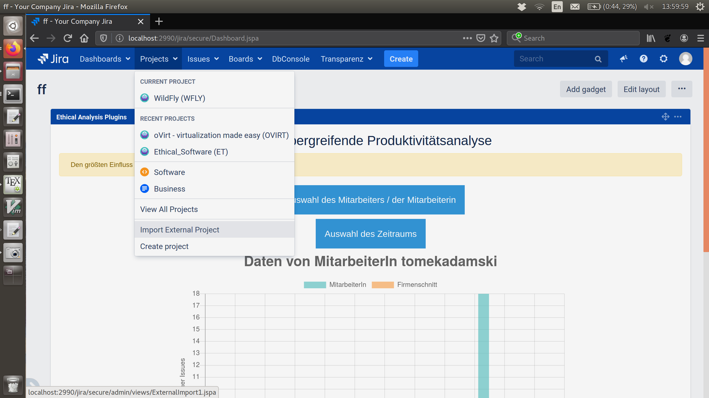

### Installation

Für JIRA benötigt dieses Plugin außer den in der Praktikumsanleitung angegebenen noch die Fähigkeit, Projekte vom Typ "Software" zu importieren. Dazu muss das im Ordner `SourceCode` befindliche `pom.xml` verwendet werden. Der Code im Ordner `SourceCode` kann mit dem zur Verfügung gestellten Gerüst benutzt werden. Dazu

- im Ordner `scaffold` das hier bereitgestellte `pom.xml` einfügen.

- im Ordner `/src/main/resources/gadgets/ethical-plugin` das hier bereitgestellte `gadget.xml` einfügen.

- im Ordner `/src/main/resources/js` das hier bereitgestellte `dashboardPlugin.js` einfügen.

### Datenimport

Das Plugin benötigt interne Daten von JIRA Issues. Wir stellen diese als .csv im Ordner `data` bereit. Zum Import bitte den folgenden Schritten folgen:

1. In der Navigationsleiste Projects > Import External Project auswählen.

1. Im nächsten Schritt "CSV" auswählen.

1. Das passende .csv auswählen, z.B. das aus unserem `data` Ordner. Es empfiehlt sich zudem, die von V. Zieglmaier bereitgestellte Konfigurationsdatei `config.txt` zu verwenden, die sich im Ordner `SourceCode` befindet.

1. Im weiteren Verlauf die angezeigten Häkchen setzen.

### Verwendung

Im Ordner `scaffold` mit `atlas-run` (muss möglicherweise 2x ausgeführt werden) das JIRA System starten und wie in der Praktikumsanleitung fortfahren.
